# Self Managed OSDU

<!-- [](https://github.com/danielscholl/self-managed-osdu/actions/workflows/stamp-init.yaml)

[](https://github.com/danielscholl/self-managed-osdu/actions/workflows/stamp-builder.yaml)

[](https://github.com/danielscholl/self-managed-osdu/actions/workflows/stamp-provision.yaml)

[](https://github.com/danielscholl/self-managed-osdu/actions/workflows/stamp-configure.yaml) -->

This is a prototype used to evaluate the possibility of providing an easy self managed instance of [OSDU on Azure](https://community.opengroup.org/osdu/platform/deployment-and-operations/infra-azure-provisioning) to ease the development experience of developing components or extensions that might run on top or inside of the OSDU Platform that runs in Azure.

__Goals:__

1. Build an automation layer on top of OSDU on Azure without impacting the official OSDU Platform.
2. Ease the amount of required knowledge needed to deploy the platform.
3. Allow for customizations and configuration.
4. Provide access to and control of all software components installed.

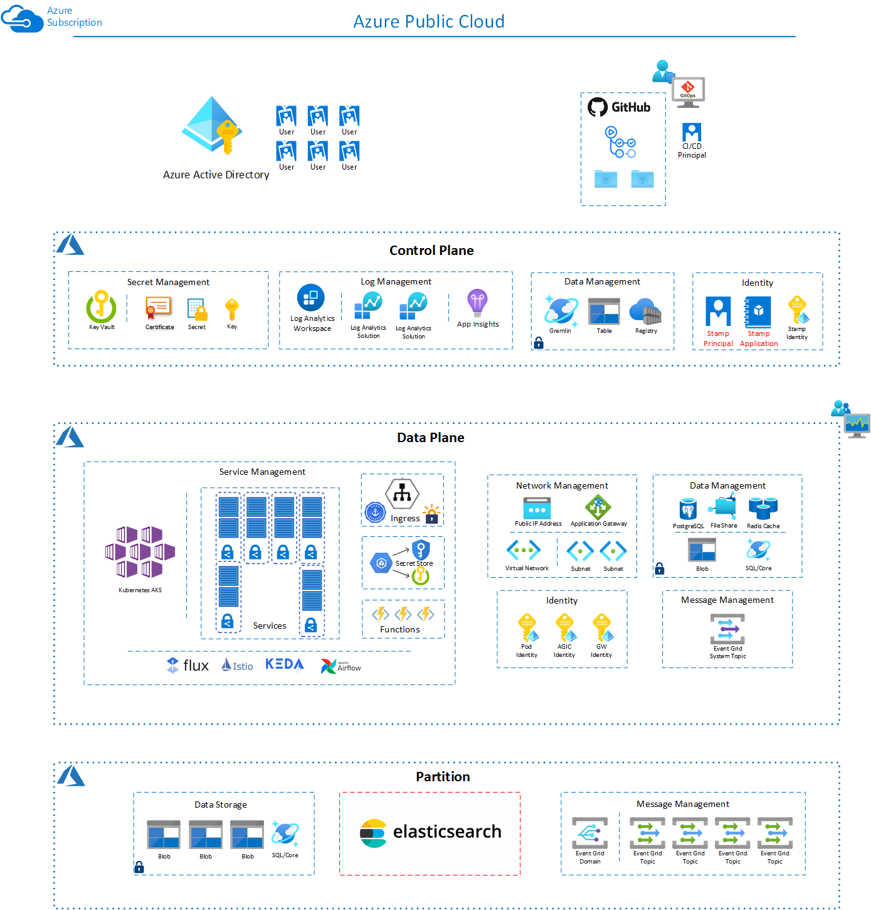


## Initialize the project

The solution is designed to operate from a fork instance of the project.

1. Fork the Project into your own GitHub Account.
2. Edit the Configuration Settings. _(see [Configuration](configuration))_
3. Add any customizations (Optional) _(see [Customizations](customizations))_


## Configure GitHub Secrets

Secrets are managed using [Github Repository Secrets](https://docs.github.com/en/actions/reference/encrypted-secrets) some secrets are required to be created manually while others are created automatically by running Github Actions

__Manually Created Secrets__

1. `GH_REPO_TOKEN`: A personal access token with `repo` scope.
2. `ELASTIC_ENDPOINT`: The endpoint of the Elasticsearch cluster.

```bash
# Sample Format
https://my-osdu.es.southcentralus.azure.elastic-cloud.com:9243
```

3. `ELASTIC_PASSWORD`: The password of the Elasticsearch cluster.
4. `AZURE_LOCATION`: The Azure Region to deploy the resources to.
5. `AZURE_CREDENTIALS`: The json output of a Service Principal with _Owner_ Subscription Scope.

```bash
SUBSCRIPTION_ID=$(az account show --query id --output tsv)
AZURE_CREDENTIALS="self-managed-osdu-azure-credentials-$(az account show --query user.name -otsv | awk -F "@" '{print $1}')"

az ad sp create-for-rbac --name $AZURE_CREDENTIALS \
  --role "Owner" \
  --scopes /subscriptions/$SUBSCRIPTION_ID \
  --sdk-auth \
  -ojson

# Sample Format
{
  "clientId": "00000000-0000-0000-0000-000000000000",                       # Client ID GUID
  "clientSecret": "**********************************",                     # Client Secret
  "subscriptionId": "00000000-0000-0000-0000-000000000000",                 # Subscription ID GUID
  "tenantId": "00000000-0000-0000-0000-000000000000",                       # Tenant ID GUID
  "activeDirectoryEndpointUrl": "https://login.microsoftonline.com",
  "resourceManagerEndpointUrl": "https://management.azure.com/",
  "activeDirectoryGraphResourceId": "https://graph.windows.net/",
  "sqlManagementEndpointUrl": "https://management.core.windows.net:8443/",
  "galleryEndpointUrl": "https://gallery.azure.com/",
  "managementEndpointUrl": "https://management.core.windows.net/"
}
```

6. `OSDU_CREDENTIALS`: The json output a Service Principal with _Contributor_ Subscription Scope.

```bash
SUBSCRIPTION_ID=$(az account show --query id --output tsv)
OSDU_CREDENTIALS="self-managed-osdu-stamp-credentials-$(az account show --query user.name -otsv | awk -F "@" '{print $1}')"

az ad sp create-for-rbac --name $OSDU_CREDENTIALS \
  --role "Contributor" \
  --scopes /subscriptions/$SUBSCRIPTION_ID \
  --sdk-auth \
  -ojson

# Sample Format
{
  "clientId": "00000000-0000-0000-0000-000000000000",                       # Client ID GUID
  "clientSecret": "**********************************",                     # Client Secret
  "subscriptionId": "00000000-0000-0000-0000-000000000000",                 # Subscription ID GUID
  "tenantId": "00000000-0000-0000-0000-000000000000",                       # Tenant ID GUID
  "activeDirectoryEndpointUrl": "https://login.microsoftonline.com",
  "resourceManagerEndpointUrl": "https://management.azure.com/",
  "activeDirectoryGraphResourceId": "https://graph.windows.net/",
  "sqlManagementEndpointUrl": "https://management.core.windows.net:8443/",
  "galleryEndpointUrl": "https://gallery.azure.com/",
  "managementEndpointUrl": "https://management.core.windows.net/"
}
```

7. `OSDU_CREDENTIAL_OID`: The Object ID of the _OSDU_CREDENTIALS_ Service Principal.

```bash
az ad sp list --display-name $OSDU_CREDENTIALS --query [].objectId -otsv
```

8. `OSDU_APPLICATION`: The json output of an Azure AD Application.

```bash
OSDU_APPLICATION="self-managed-osdu-stamp-application-$(az account show --query user.name -otsv | awk -F "@" '{print $1}')"

az ad app create --display-name $OSDU_APPLICATION \
  --oauth2-allow-implicit-flow \
  --required-resource-accesses @configuration/manifest.json \
  --query '{appId:appId, displayName:displayName, objectId:objectId}' \
  -ojson


  # Sample Format
{
  "appId": "00000000-0000-0000-0000-000000000000",
  "displayName": "osdu-application",
  "objectId": "00000000-0000-0000-0000-000000000000"
}
```

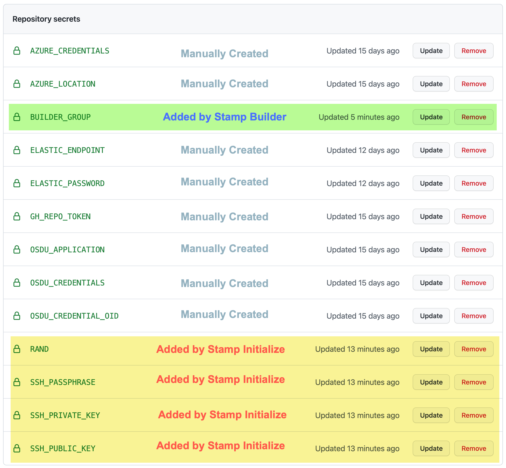


## Execute Github Actions

Deployment of a self managed osdu instance is performed by executing github actions to work with a [Deployment Stamp](https://docs.microsoft.com/en-us/azure/architecture/patterns/deployment-stamp).  Currently there is only support for the deployment of 1 stamp.


1. __[Stamp Initialize](../../actions/workflows/stamp-init.yaml)__: This action initializes any neccesary items in github that are necessary to begin (ie: Randomizer Secrets, ssh keys). _(Time: ~30s)_

2. __[Stamp Builder](../../actions/workflows/stamp-builder.yaml)__: This action provisions resources necessary to support a provisioning process (ie: Terraform State and Secret Storage). _(Time: ~3m)_

3. __[Stamp Provision](../../actions/workflows/stamp-provision.yaml)__: This action provisions resources for the Deployment Stamp.  _(Time: ~1h)_

4. __[Stamp Configure](../../actions/workflows/stamp-configure.yaml)__: This action initializes the Software Configuration process of the Deployment Stamp.  _(Time: ~20m)_

  > Note: The pipeline creates the software configuration definition which is performed by Flux and will complete in ~2m. Flux will then manage the installation process from within the cluster and will complete in ~18m.

5. __[Stamp Load](../../actions/workflows/stamp-load.yaml)__: This action loads any necessary data into the Stamp in order to properly function. (ie: Entitlements TenantInit, Public Schemas)  _(Time: ~20m)_

  > Note: The pipeline brings airflow online which is not currently done by `Stamp Configure` due to compatability issues with Airflow and Flux v3.


## Azure Resources

The following resources are created in Azure for a Deployment Stamp.

__Builder__

1. Azure Key Vault (Standard)
2. Azure Storage Account - Table (StorageV2-LRS)

__Control Plane__

1. Log Analytics Workspace - 2 Solutions - Container & KeyVault (Pay-as-you-go)
2.  Application Insights (Pay-as-you-go)
3. Azure Key Vault (Standard)
4. Azure Storage Account - Table (StorageV2-LRS)
5. Azure Cosmos DB Account - Gremlin (4000 Max RU's - Shared)
6. Azure Container Registry - (Standard)
7. User Managed Identity 

__Data Plane__

1. Azure Virtual Network
2. Azure Storage Account - Qty2 (StorageV2-LRS)
4. Event Grid System Topic
5. Application Gateway - (WAFv2 w/ Autoscale (2-10))
6. Public IP Address
7. Azure Database for Postgres (General Purpose - 4vCore 5GB)
8. Azure Cosmos DB Account - Core (12000 Max RU's - Shared)
9. Azure Cache for Redis (Standard 1Gb)
10. Azure Kubernetes Service - System NodePool (2 Standard_E4s_v3), User NodePool (5-10 Standard_E4s_v3)
11. User Managed Identity - Qty3 

__Data Partition__

1. Service Bus Namespace (Standard)
2. Event Grid Domain w/ 5 Topics (Basic)
3. Azure Cosmos DB Account - Core (12000 Max RU's - Shared)
4. Azure Storage Account - Qty2 (StorageV2-GZRS)


## Platform Access

### Verify the `osdu-azure` services have successfully started.

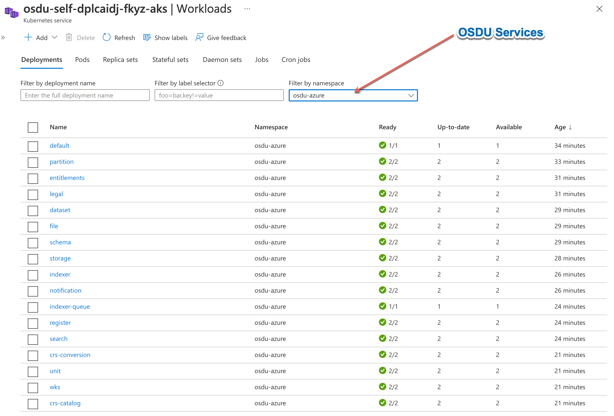
---

### Verify the `self-managed-osdu` instance is available.

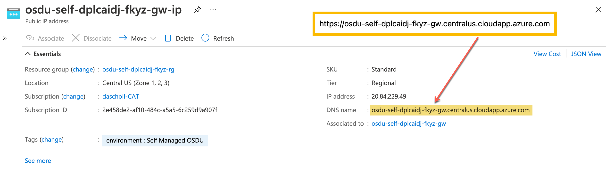
---
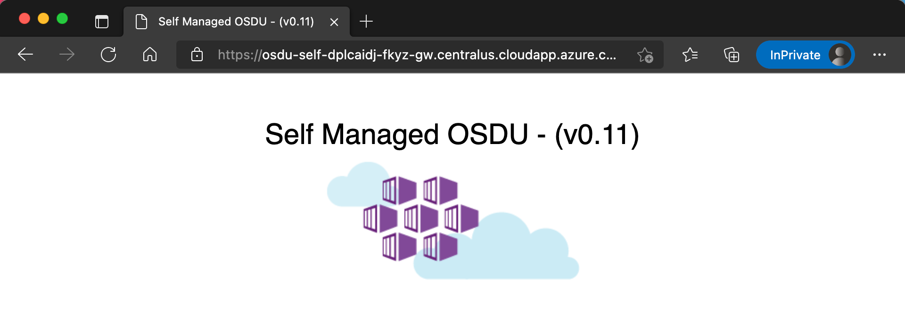
---

### Configure the AD Application for `Web Platform` access.

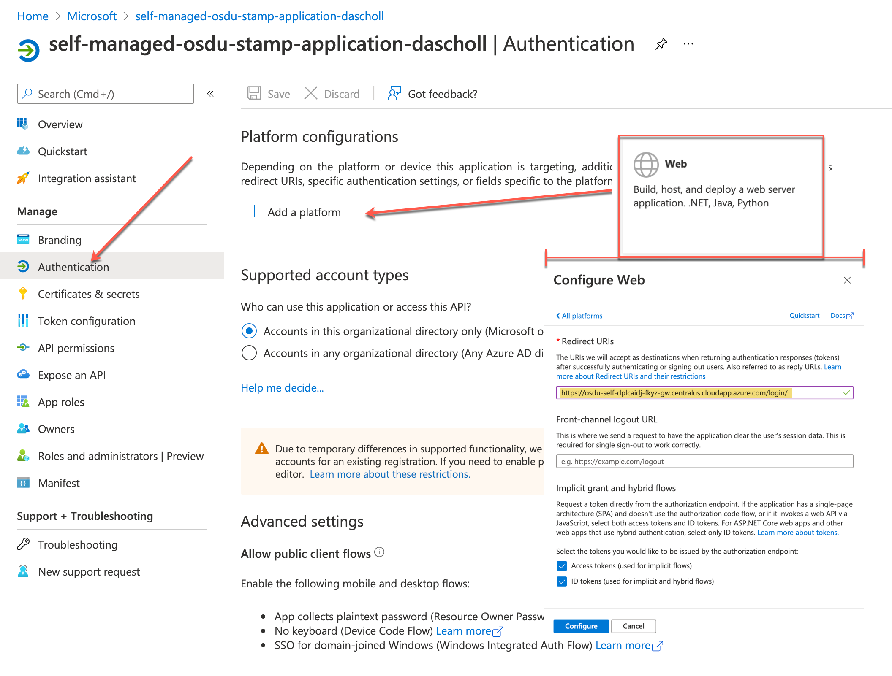
---

### HTTP Rest Scripts

The simpliest way to execute against the Platform is to leverage the HTTP Rest Scripts that make testing and executing API calls easier.  These scripts are compatable with the VS Code Extension [REST Client](https://marketplace.visualstudio.com/items?itemName=humao.rest-client).

[Rest Client Settings](https://github.com/Huachao/vscode-restclient#environment-variables) can be set to create environments and saved in [VS Code Settings](https://vscode.readthedocs.io/en/latest/getstarted/settings/).

__Retrieve the Rest Client Environment Setings__

For convenience the Rest Client Environment Settings can be retrieved from the `builder` keyvault. _(An access policy must be created to retrieve secrets)_

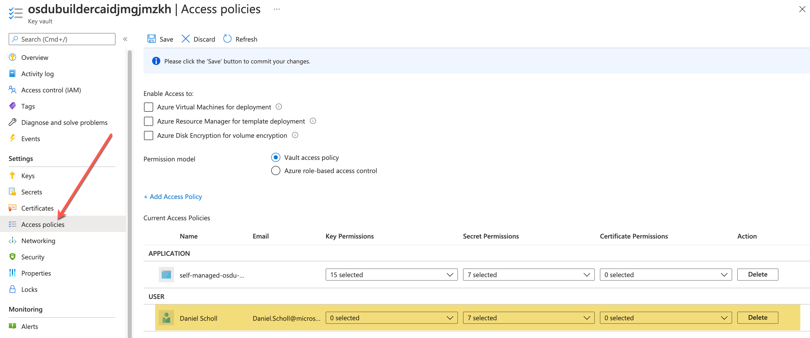
---
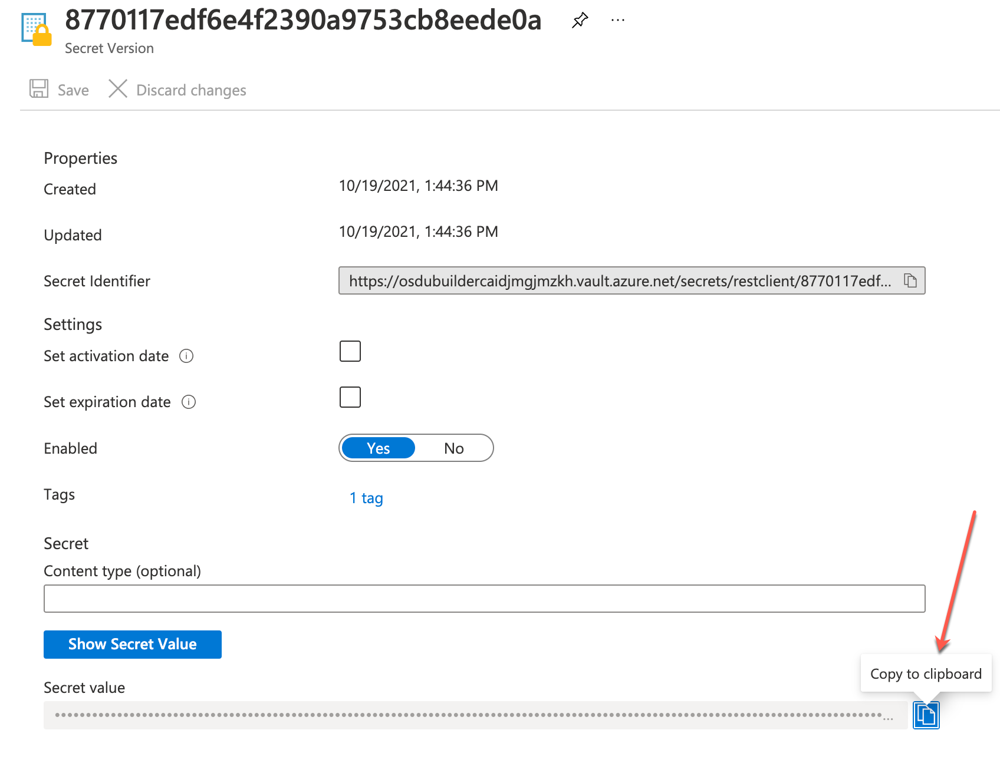

These settings can now be placed in the `.vscode/settings.json` file along with a `Client Secret` that is used to authenticate the Rest Client.

---
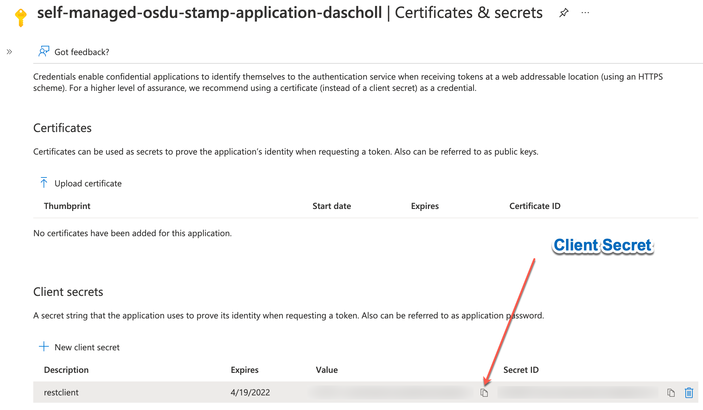
---
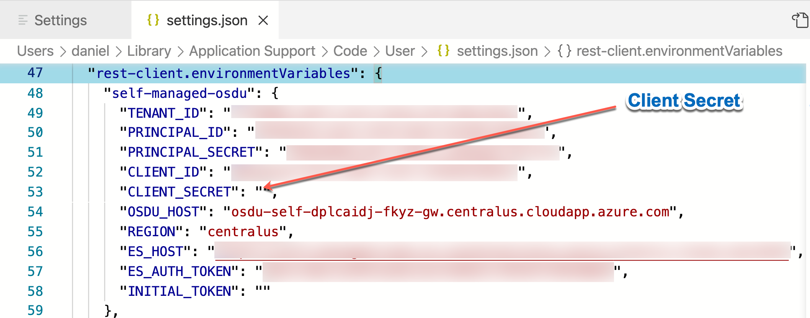


__Validate Partition Access__

The Partition should be initialized automatically.  Validate the Partition is accessible.

---
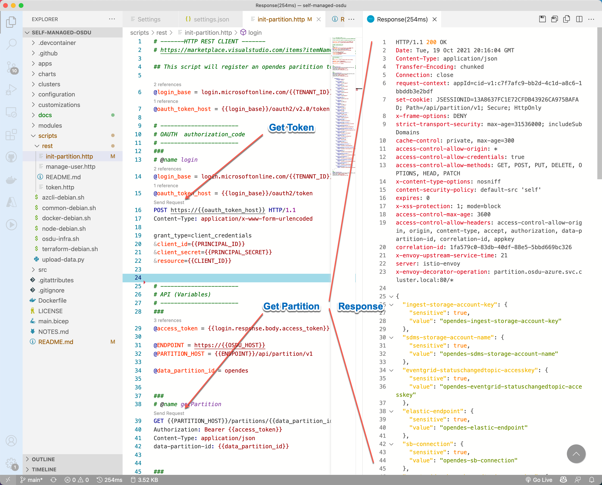

__Configure RBAC Access__

Entitlements needs to be initialized.  This can be done by running the `manage-user.http` script.

---

- __Retrieve an OAuth Token__

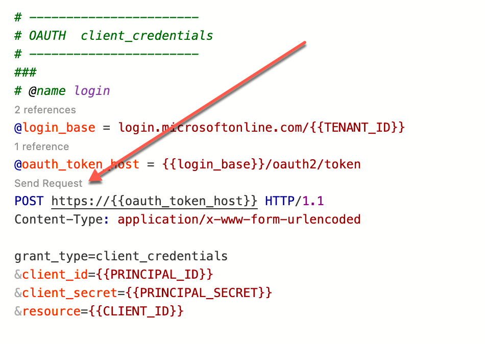

- __Define Intial OpenID Connect User__


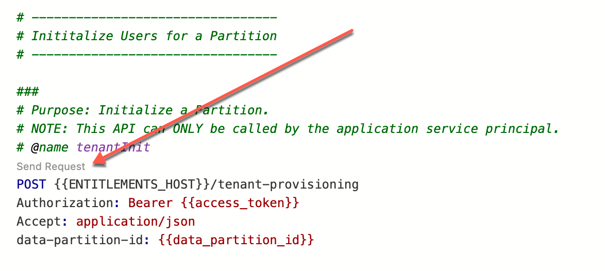

- __Create the Intial OpenID Connect User__

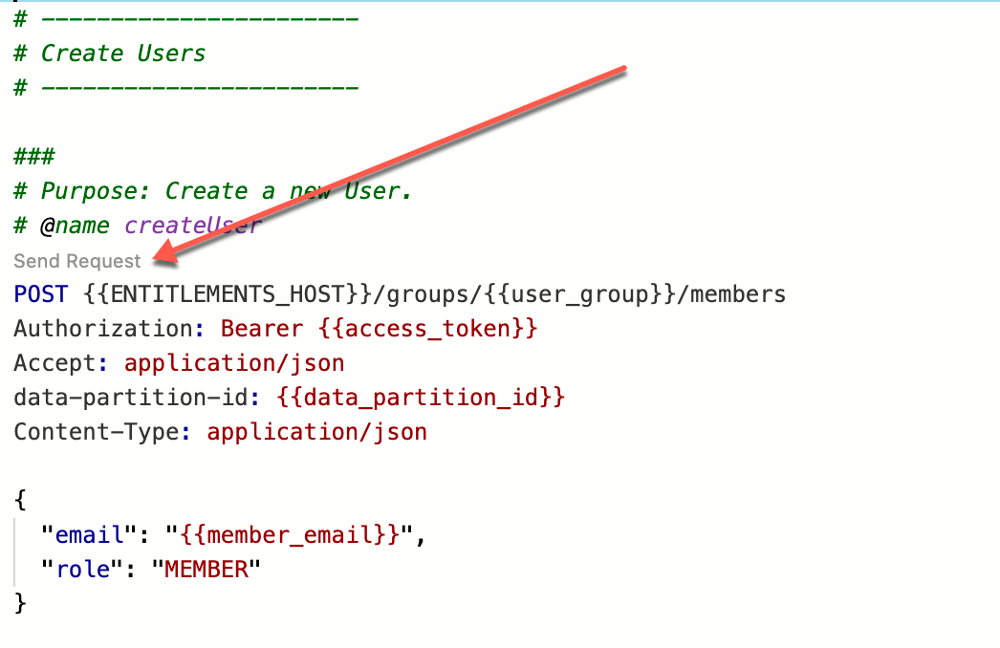

- __Assign the User to the desired RBAC Group__

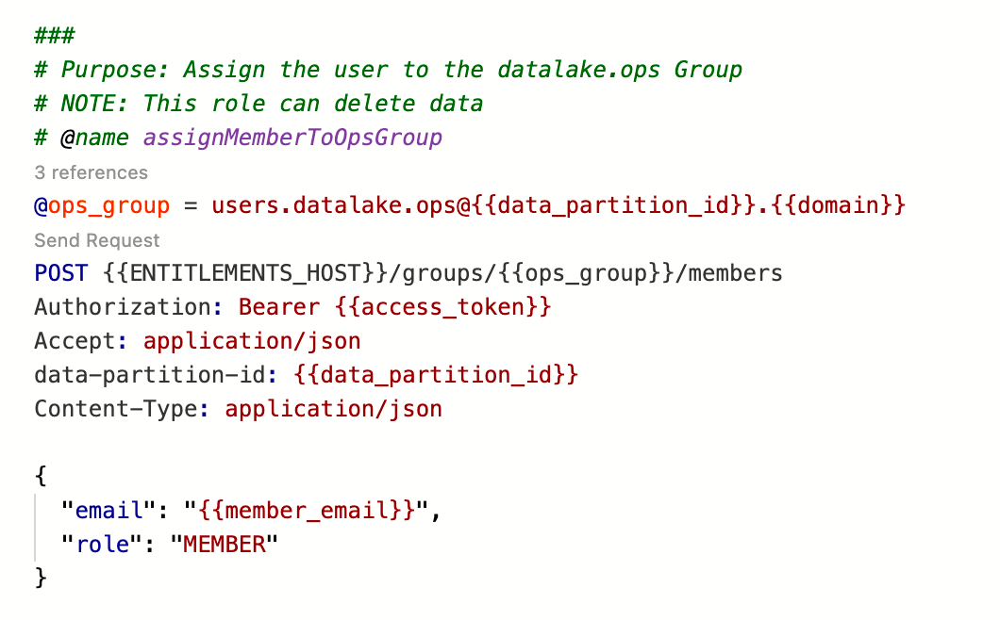

---

__Login the First User__

User authentication leverages the [Microsoft Identity Platform and OpenID Connect](https://docs.microsoft.com/en-us/azure/active-directory/develop/v2-protocols-oidc) procotol.  To enable an easier method of obtaining the required tokens an authcode login page with a rest-client http script are used to obtain API tokens.

- __Retrieve an Authorization Code__

Access the /login page from the `self-managed-osdu` instance and click the `authorize` button. Approve the access by the AD Application if required (only required for the first time) and retrieve the code.

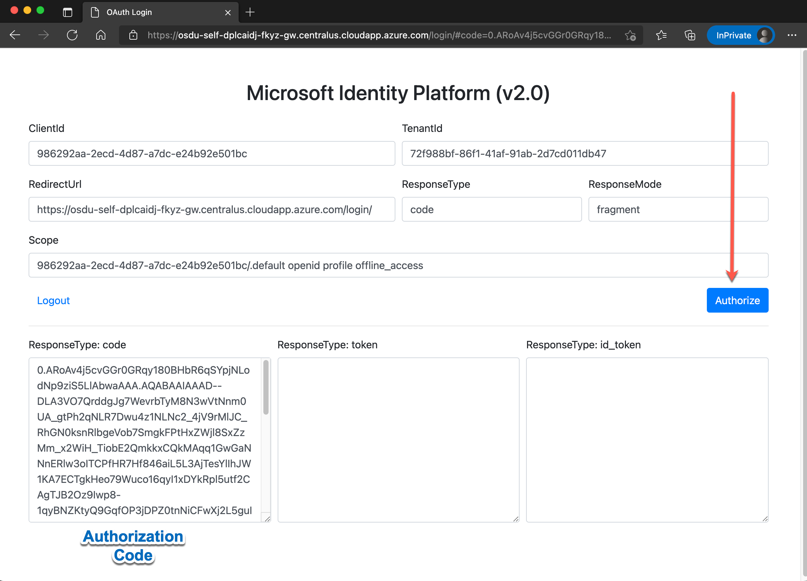

---

- __Retrieve an Initial Token__

Using the Rest-Client HTTP Script `auth-token.http` add the auth_code obtained from the previous step to the `AUTH_CODE` parameter and post the authorize request.  The returned `refresh_token` value then can be saved in the `.vscode/settings.json` file as the INITIAL_TOKEN parameter.

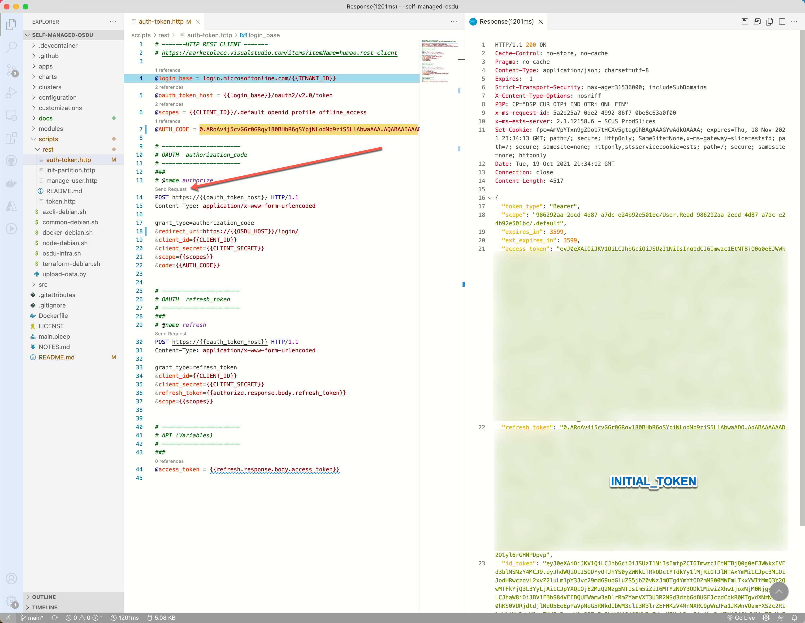

- __Execute the Platform Core Check Script__

Using the Rest-Client HTTP Script `check_core.http` validate the functionality for the platform core APIs.

