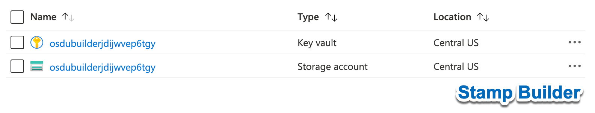
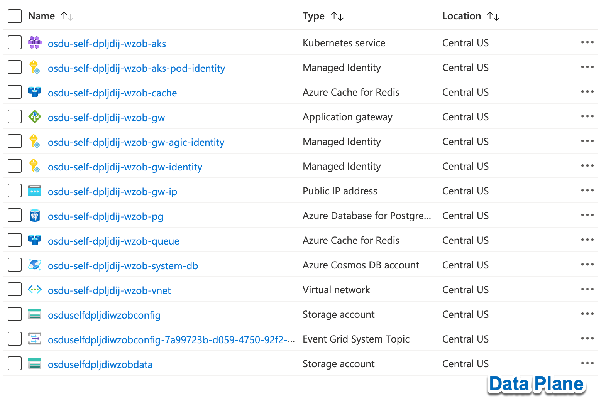

# Self Managed OSDU

[](https://github.com/danielscholl/self-managed-osdu/actions/workflows/stamp-init.yaml)

[](https://github.com/danielscholl/self-managed-osdu/actions/workflows/stamp-builder.yaml)

[](https://github.com/danielscholl/self-managed-osdu/actions/workflows/stamp-provision.yaml)

This is a prototype used to evaluate the possibility of providing an easy self managed instance of [OSDU on Azure](https://community.opengroup.org/osdu/platform/deployment-and-operations/infra-azure-provisioning) to ease the development experience of developing components or extensions that might run on top or inside of the OSDU Platform that runs in Azure.

__Goals:__

1. Build an automation layer on top of OSDU on Azure without impacting the official OSDU Platform.
2. Ease the amount of required knowledge needed to deploy the platform.
3. Allow for customizations and configuration.
4. Provide access to and control of all software components installed.


## Initialize the project

The solution is designed to operate from a fork instance of the project.

1. Fork the Project into your own GitHub Account.
2. Edit the Configuration Settings. _(see [Configuration](configuration))_
3. Add any customizations (Optional) _(see [Customizations](customizations))_


## Configure GitHub Secrets

Secrets are managed using [Github Repository Secrets](https://docs.github.com/en/actions/reference/encrypted-secrets) some secrets are required to be created manually while others are created automatically by running Github Actions

__Manually Created Secrets__

1. `GH_REPO_TOKEN`: A personal access token with `repo` scope.
2. `AZURE_LOCATION`: The Azure Region to deploy the resources to.
3. `AZURE_CREDENTIALS`: The json output of a Service Principal with _Owner_ Subscription Scope.

```bash
SUBSCRIPTION_ID=$(az account show --query id --output tsv)

az ad sp create-for-rbac --name "osdu-azure-credentials" \
  --role "Owner" \
  --scopes /subscriptions/$SUBSCRIPTION_ID \
  --sdk-auth \
  -ojson

# Sample Format
{
  "clientId": "00000000-0000-0000-0000-000000000000",                       # Client ID GUID
  "clientSecret": "**********************************",                     # Client Secret
  "subscriptionId": "00000000-0000-0000-0000-000000000000",                 # Subscription ID GUID
  "tenantId": "00000000-0000-0000-0000-000000000000",                       # Tenant ID GUID
  "activeDirectoryEndpointUrl": "https://login.microsoftonline.com",
  "resourceManagerEndpointUrl": "https://management.azure.com/",
  "activeDirectoryGraphResourceId": "https://graph.windows.net/",
  "sqlManagementEndpointUrl": "https://management.core.windows.net:8443/",
  "galleryEndpointUrl": "https://gallery.azure.com/",
  "managementEndpointUrl": "https://management.core.windows.net/"
}
```

3. `OSDU_CREDENTIALS`: The json output a Service Principal with _Contributor_ Subscription Scope.


```bash
SUBSCRIPTION_ID=$(az account show --query id --output tsv)

az ad sp create-for-rbac --name "osdu-credentials" \
  --role "Contributor" \
  --scopes /subscriptions/$SUBSCRIPTION_ID \
  --sdk-auth \
  -ojson

# Sample Format
{
  "clientId": "00000000-0000-0000-0000-000000000000",                       # Client ID GUID
  "clientSecret": "**********************************",                     # Client Secret
  "subscriptionId": "00000000-0000-0000-0000-000000000000",                 # Subscription ID GUID
  "tenantId": "00000000-0000-0000-0000-000000000000",                       # Tenant ID GUID
  "activeDirectoryEndpointUrl": "https://login.microsoftonline.com",
  "resourceManagerEndpointUrl": "https://management.azure.com/",
  "activeDirectoryGraphResourceId": "https://graph.windows.net/",
  "sqlManagementEndpointUrl": "https://management.core.windows.net:8443/",
  "galleryEndpointUrl": "https://gallery.azure.com/",
  "managementEndpointUrl": "https://management.core.windows.net/"
}
```

4. `OSDU_CREDENTIAL_OID`: The Object ID of the _OSDU_CREDENTIALS_ Service Principal.

```bash
az ad sp list --display-name "osdu-credentials" --query [].objectId -otsv
```

5. `OSDU_APPLICATION`: The json output of an Azure AD Application.

```bash
az ad app create --display-name "osdu-application" \
  --available-to-other-tenants true  \
  --query '{appId:appId, displayName:displayName, objectId:objectId}' \
  -ojson

  # Sample Format
  {
  "appId": "00000000-0000-0000-0000-000000000000",
  "displayName": "osdu-application",
  "objectId": "00000000-0000-0000-0000-000000000000"
}
```

6. `ELASTIC_ENDPOINT`: The endpoint of the Elasticsearch cluster.

```bash
# Sample Format
https://my-osdu.es.southcentralus.azure.elastic-cloud.com:9243
```

7. `ELASTIC_PASSWORD`: The password of the Elasticsearch cluster.


## Execute Github Actions

Deployment of a self managed osdu instance is performed by executing github actions to work with a [Deployment Stamp](https://docs.microsoft.com/en-us/azure/architecture/patterns/deployment-stamp).  Currently there is only support for the deployment of 1 stamp.


1. __[Stamp Initialize](../../actions/workflows/stamp-init.yaml)__: This action initializes the neccesary items in the github that are necessary in the provisioning process of a Deployment Stamp.

2. __[Stamp Builder](../../actions/workflows/stamp-builder.yaml)__: This action provisions builder resources necessary in the provisioning process of a Deployment Stamp.

3. __[Stamp Provision](../../actions/workflows/stamp-provision.yaml)__: This action provisions resources for the Deployment Stamp.


## Azure Resources

The following resources are created in Azure for the Deployment Stamp.







